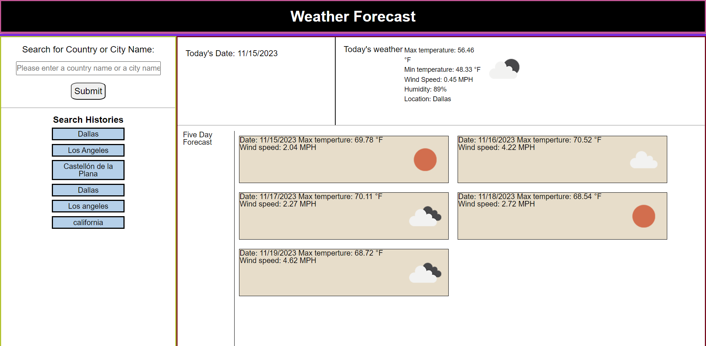

# Weather Forecast -ylf456
## Description

This weather forecast application made by HTML, CSS and Javascript was created by Yilun Fan for study use

## Installation

N/A

## Usage

To use this application, start by input a city name in language:english in the top left corner of the input form, and click on the search button. If the input is a city name which the location is inside United States, the weather of today and weather of future five days will be displayed on the page. Otherwise, only today's weather will be displayed on the page. The search history will also be render to the page and will be persisted even the page is refreshed.

## Credits

 weather data are pulled from the API provided by https://openweathermap.org/

## License

N/A

## Link to this application

link to this application: https://ylf456.github.io/module-6-challenge-ylf456-weather-forecast/

link to github repo: https://github.com/ylf456/module-6-challenge-ylf456-weather-forecast.git

## Screenshots

